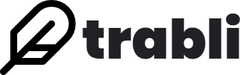

  

# Resumo

Aplicação elaborada como trabalho de conclusão de curso técnico do Instituto Federal de Educação, Ciência e Tecnologia do Rio Grande do Norte. Os trabalhos escritos com a aplicação são salvos automaticamente no navegador. Quando um trabalho é aberto, qualquer usuário com o link pode conectar-se a sua máquina e editá-lo simultaneamente. Você pode simular esse comportamento abrindo o mesmo trabalho em abas diferentes.

# Bibliotecas

- [Remirror](https://remirror.io)
- [Yjs](https://yjs.dev/)
- [Paged.js](https://pagedjs.org)

# Testando

1. Clone o repositório
2. Instale as dependências rodando `npm i`
3. Certifique-se de usar o navegador Chrome para que a página inicial liste os trabalhos salvos corretamente.

# Saiba mais

<https://suap.ifrn.edu.br/media/edu/projeto_final/TRABLI__UM_EDITOR_COLABORATIVO_PARA_TRABALHOS_ACAD%C3%8AMICOS-4f3ff1be93094_6ocIljs.pdf>
